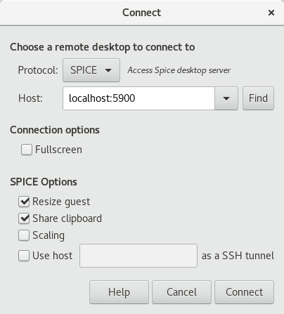

# Containerized Xorg Desktop Accessed via SPICE/HTML5

Containerized remote Xorg Desktop using [Spice](https://fedoraproject.org/wiki/Features/Spice),
can be accessed using the included Html5 client.

It uses basic lightweight OpenBox, you can make [OpenBox awesome](https://fedoramagazine.org/openbox-fedora/) if you like by:

- adding background image using `feh`
- adding panels using `tint2`
- fancy display of information using `conky`

## Use cases

Can be used to provide

- light weight remote desktops
- automation (launch firefox/chrome and do some automated tests)
- in-browser IDEs
- access a service from different place

## Using SPICE clients

You can use any remote desktop client that support spice protocol.



First you need to start the server, which is in our case a container

```
docker run -d -p 5900:5900 --name myspice alsadi/containerized-xorg-spice
```

you can install more software by entering the container and your applications

```
docker exec -ti -u root myspice /bin/bash
dnf install eclipse firefox 
```

## Using the included HTML5 client

We have included HTML5 client, so you can run the entire stack of

- your SPICE desktop
- static files serving the HTML5 client
- `websockify` to tunnel SPICE into `websocket`

you can do this using one single command

```
docker-compose up
```

## Customization

This image uses a regular user `app`, place any executable file in `/home/app/.config/openbox/autostart.d/`
which will be executed in background during start up.

currently it only launches `xterm`

